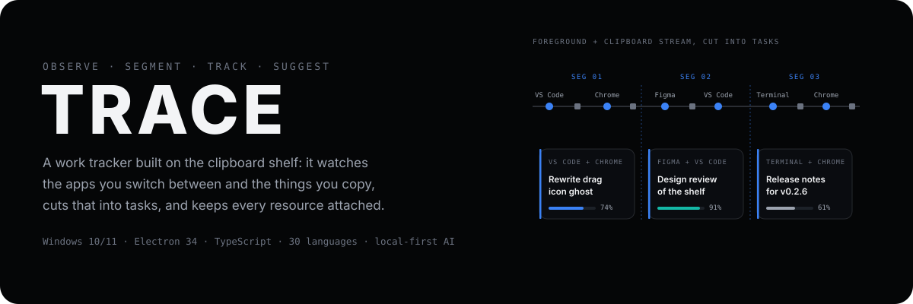
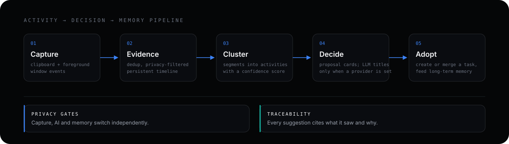

<p align="center">
  
</p>

<p align="center">
  <strong>Trace is not another clipboard manager — it is a work tracker that lives inside one.</strong>
  On the edge of your screen, the shelf collects what you copy. Underneath it, Trace watches the
  whole slice of work: the apps you switch between, the windows you work in, the clips you gather.
  It cuts that slice into <strong>tasks</strong>, tracks their progress, and keeps every resource —
  apps, windows, clips — attached to the task it belongs to.
</p>

<p align="center">
  
  
  
  
  <a href="LICENSE"></a>
</p>

<p align="center">
  <a href="#what-is-trace">What is Trace</a> ·
  <a href="#demos">Demos</a> ·
  <a href="#features">Features</a> ·
  <a href="#how-it-works">How it works</a> ·
  <a href="#quick-start">Quick Start</a> ·
  <a href="#status">Status</a> ·
  <a href="#security">Security</a>
</p>

---

## What is Trace

Most clipboard managers treat what you copy as a list. Trace treats it as **evidence of what you are working on**.

Trace looks at your work from a cross-section: at any moment it knows the foreground app, the window title, and the clips you copy. Over time that cross-section becomes a stream — and the stream is cut into **tasks** at cluster boundaries, the way you would segment a long session into "write the API docs", "fix the drag icon", "review the design". Each segment becomes a candidate task card with a confidence score, the apps and windows involved, and the clipboard material attached.

The **task** is the hub, not the clipboard item. A task collects the windows you worked in (one click jumps back to them), the apps involved, and the clips you explicitly bind to it. Its state machine — one running task at a time, waiting, paused, completed — tracks progress honestly, with every transition annotated by who made it and why.

None of this asks you to do anything extra. The observation is built directly on the clipboard mechanism you already use: the hover-to-open shelf on the screen edge is at once the **capture point**, the **resource repository**, and the **operation surface**. You copy, you drag, you work — Trace segments and suggests in the background, and the AI pass (titles, rationale, memory) is optional, off by default, and explainable.

**This repository is a fork of [Edge-Drop](https://github.com/Deepender25/Edge-Drop).** The clipboard shelf is inherited and kept as the base; the task layer and the AI suggestion pipeline are rebuilt on top, with upstream's auto-update and sponsor plumbing removed.

> **Platform:** Windows 10/11 only. The drag-out pipeline uses Win32 OLE and the edge trigger uses transparent-window cursor polling — there is no macOS or Linux port.

---

## Demos

> All demos are silent autoplay loops. Hover to scrub, right-click → open in new tab for full size.

<table>
  <tr>
    <td width="50%" align="center"><b>1. Welcome to Trace</b><br/><br/>
      <video src="https://github.com/user-attachments/assets/118d59cc-9821-4da1-9424-ea9bc1b6e548" width="100%" autoplay loop muted playsinline></video>
    </td>
    <td width="50%" align="center"><b>2. Collect Anything</b><br/><br/>
      <video src="https://github.com/user-attachments/assets/8daa18a7-d023-4e93-9f17-c30791a7c41c" width="100%" autoplay loop muted playsinline></video>
    </td>
  </tr>
  <tr>
    <td width="50%" align="center"><b>3. Drag & Drop Anywhere</b><br/><br/>
      <video src="https://github.com/user-attachments/assets/ac8bc411-0827-460c-828c-0799f4cee4d8" width="100%" autoplay loop muted playsinline></video>
    </td>
    <td width="50%" align="center"><b>4. Explore File Stacks</b><br/><br/>
      <video src="https://github.com/user-attachments/assets/b1e47a2b-41d2-4958-8e42-4fefcaa8b26b" width="100%" autoplay loop muted playsinline></video>
    </td>
  </tr>
  <tr>
    <td width="50%" align="center"><b>5. Ungroup & Split Stacks</b><br/><br/>
      <video src="https://github.com/user-attachments/assets/e41eb9f8-62b0-4525-a28a-2bacafd0bb8c" width="100%" autoplay loop muted playsinline></video>
    </td>
    <td width="50%" align="center"><b>6. Combine & Merge Items</b><br/><br/>
      <video src="https://github.com/user-attachments/assets/cee7d5f7-658b-433a-9fa0-6592a5a75fa4" width="100%" autoplay loop muted playsinline></video>
    </td>
  </tr>
  <tr>
    <td width="50%" align="center"><b>7. Preview Flyout</b><br/><br/>
      <video src="https://github.com/user-attachments/assets/fe5a8b47-08c6-4d32-92b6-bb4e0446a82a" width="100%" autoplay loop muted playsinline></video>
    </td>
  </tr>
</table>

---

## Features

### Watching your work — segmentation

- **A cross-section, not a log.** A 600 ms clipboard watcher and a foreground-window listener feed one event stream: app switches, window titles, copies. No separate capture ritual — the shelf already exists.
- **Evidence timeline.** Events are deduplicated (FNV-1a signatures, sampled BGRA hashes for images), privacy-filtered, and persisted so any suggestion can be traced back to what was seen.
- **Quiet-period clustering.** During silences, the clusterer segments the stream into activities. Each segment becomes a candidate task card: title, confidence, the apps and windows involved, and the clipboard items it carries.
- **Accept, merge, or ignore.** Accept opens the guided editor; a candidate that matches an existing task merges into it instead. Ignoring writes the signature to a blocklist so the same suggestion does not return.

### Tasks as the hub

- **Guided editor.** Title, an app grid (most recently used first), and a clipboard material picker. When a provider is configured, the AI suggests a title and a one-line rationale; without one, the editor falls back to an algorithmic title — the flow never blocks on AI.
- **Linked windows.** Each task remembers the foreground window it was created from. "Open app" jumps back to that window, or the app's latest window, or launches the app when it is gone.
- **Explicit resource binding.** Drag a shelf item onto a task card or the binding panel to attach it as linked content. Clips never auto-attach — linkage is a decision, not a side effect.
- **Honest states.** One task runs at a time (single `RUNNING`); `WAITING` means the system infers you paused, `PAUSED` means you explicitly did, `COMPLETED` and `ARCHIVED` end the lifecycle. Every transition is annotated with its source (user / system) and reason — the UI can tell "you paused it" apart from "the system thinks you are resting".
- **Task detail.** Linked apps and windows, bound content, confidence, and the creation reason — why this task was suggested in the first place.

### AI as an optional pass

- **Works without AI.** The whole pipeline runs on deterministic clustering; LLM annotation (title + rationale) is a separate pass that only happens when you configure a provider chain (any OpenAI-compatible endpoint) in Settings → Tasks.
- **Explainable.** Every suggestion cites what it saw and why. The task detail view shows the creation reason; `ai-log.jsonl` records each chat call and algorithm output for inspection.
- **OCR context.** When a provider is set, an OCR pass on the foreground window may add screen text to the suggestion context. OCR output is never shown in the UI and never persisted.
- **Long-term memory.** Accepted tasks feed a memory store (episode / entity / fact) that nudges the confidence of future segments; candidates sit in the memory panel in Settings until you confirm or dismiss them.

### The zero-friction base — the clipboard shelf

- **Hover to open.** A 3px hysteresis zone with a 120 ms dwell opens the panel; moving away closes it with a grace period. The collapsed window is 100% click-through, so the desktop stays fully usable. Hover can be disabled in Settings — `Alt+C` opens the panel instead.
- **Pick your monitor and edge.** Left or right edge, any display; the choice survives reboots (session ID → geometry match → nearest → primary fallback). Fullscreen apps (games, video, presentations) suppress the trigger automatically via native `SHQueryUserNotificationState` detection.
- **Multi-format clipboard.** Plain text, rich HTML, URLs, raw images, and multi-file selections. Duplicate copies are bumped to the top and counted.
- **Stacks.** Multi-file drag-ins and multi-image copies group into stacks (max 10) with expand / split / merge, plus a preview flyout for single files and collections.
- **Native OLE drag-out.** Real file handles, not simulated drags: text goes out as a temp UTF-8 file, images and file stacks as files with rendered drag ghosts. Drag files *in* to add them.
- **30 languages, 5 themes.** Full UI dictionaries for 30 languages with RTL layout for Arabic and Hebrew; Graphite / Cobalt / Verdigris / Amber / Violet accent themes applied to the panel, drag ghost, and copy indicator.
- **Battery-aware.** Cursor polling slows on battery power; sleep and unlock events pause the clipboard watcher so no false copy indicators fire when you open the laptop lid.

### Privacy

- **Three privacy planes.** Capture (foreground events), AI (anything leaving the machine), and Memory (what is retained) are enforced by a pure gate module — capture can be switched off entirely, AI only runs when you configure a provider, and denied data never reaches the model, not even as context. A denial always carries a reason for the trace log.
- **Sensitive formats skipped.** Password managers and dictation tools (Bitwarden, KeePass, 1Password, `ExcludeClipboardContentFromMonitorProcessing`, …) are matched case-insensitively and never captured.
- **Incognito and auto-delete.** One click suspends clipboard polling; auto-delete timers (1h / 6h / 24h / 7d) and clear-unpinned-on-restart keep history bounded.
- **No telemetry, no auto-update.** There is no analytics or telemetry; the only network calls are the What's New release check and the AI providers you configure. Upstream's silent auto-updater was deliberately removed so a remote release can never overwrite a local build.

---

## How it works

The core loop, from raw events to adopted tasks — the same stream that fills the shelf is what the tracker segments:

<p align="center">
  
</p>

Three isolated processes follow a strict contract:

1. **Main** (`electron/main/`) — Node.js runtime. Owns the clipboard watcher, the OLE drag pipeline, window/edge handling, and the task & suggestion engines. It is the single source of truth: every change pushes a full state snapshot to the renderer.
2. **Preload** (`electron/preload/`) — sandboxed bridge exposing `window.edge`, typed against `shared/ipc.ts` (`InvokeMap` / `EventMap` / `SendMap`) and `shared/bridge.ts` (`EdgeApi`). A new channel touches four files: contract, interface, preload implementation, and main handler.
3. **Renderer** (`src/`) — React 18 UI. A Zustand store is a pure view cache of main's pushes; the renderer never persists anything itself.

Windows-specific integration points: koffi (FFI) reads native clipboard formats and detects fullscreen apps; PowerShell handles HDROP file lists (bypassing Electron's single-file limit) and simulated paste; drag ghosts are rendered server-side with `@resvg/resvg-js`. The SuggestionEngine is a pure module — everything it needs is injected, so vitest drives it with a fake clock and a real task store.

---

## Quick Start

### Prerequisites

- **Node.js** 18+ (npm 11+ blocks postinstall scripts by default)
- **Windows 10/11**

### Run from source

```bash
git clone https://github.com/PaRr0tBoY/Trace.git
cd Trace
npm install
npm run dev    # Electron + Vite HMR
```

> [!NOTE]
> If `npm install` finishes but the first launch fails with missing binaries, approve the postinstall scripts and retry: `npm approve-scripts electron esbuild koffi better-sqlite3 node-llama-cpp`

### Verify, test, package

```bash
npm run typecheck   # tsc --noEmit for both node and web configs
npm test            # 896 unit tests (vitest)
npm run package     # Windows NSIS installer into dist/
npm run build:store # Windows MSIX for the Microsoft Store
```

> [!NOTE]
> If packaging fails with `EBUSY: resource busy or locked`, close any running Trace instance first: `taskkill /F /IM electron.exe /T`

---

## Project structure

```
├─ shared/                 IPC contracts & domain types
│  ├─ ipc.ts               InvokeMap / EventMap / SendMap channel definitions
│  ├─ bridge.ts            EdgeApi interface implemented by preload
│  └─ types.ts             ItemData, Task, TaskProposal, Settings, DTOs
├─ electron/
│  ├─ main/                window & edge trigger, drag (OLE), suggestionEngine
│  │                       (lifecycle controller), provider chain + decision
│  │                       provider, currentTaskController, MemoryStore wiring,
│  │                       ocr, windowSwitch (linked windows), focus,
│  │                       imageProtocol, aiLog, fullscreen (koffi),
│  │                       powershell, tray
│  ├─ preload/             sandboxed contextBridge
│  ├─ clipboard/           ClipboardWatcher (600ms poll), formats (FNV-1a, HDROP)
│  └─ store/               db.ts (SQLite canonical: 7 tables + FTS5 + WAL),
│                          ItemStore, TaskStore (state machine + commit seam),
│                          sessionStore, activityLedger (clustering),
│                          evidenceStore, traceStore, recommendationHistory,
│                          proposalGrading, memoryGraph (episodes/entities/facts),
│                          episodeConsolidator, privacyGate, localModelManager /
│                          localModelRuntime, MemoryStore, settings, paths
├─ src/                    React renderer
│  ├─ components/          Panel, Header, ItemList, PreviewFlyout, Settings,
│  │  └─ tasks/            TaskView, TaskEditor, TaskDetail, TaskProposalCard,
│  │                       TaskDropPanel, ContentPicker
│  ├─ hooks/               useEdgeHover (hysteresis), useDragOut
│  ├─ lib/                 fileTabs, theme, restore, taskEditor model
│  ├─ i18n/                translations for 30 languages
│  └─ store/               Zustand appStore (view cache of main state)
├─ assets/readme/          hero and pipeline visuals
└─ tests/                  44 vitest files, 896 cases
```

---

## Tech stack

| Layer             | Choice                      | Why                                                                       |
| ----------------- | --------------------------- | ------------------------------------------------------------------------- |
| Desktop runtime   | **Electron 34**             | Only way to reach Win32 OLE drag and native clipboard formats from JS     |
| Build tooling     | **electron-vite**           | Separate Main / Preload / Renderer builds with Vite HMR                   |
| UI                | **React 18 + TypeScript 5** | Typed component tree; sandboxed renderer                                  |
| State / animation | **Zustand + Framer Motion** | Single-source-of-truth pushes, spring physics                             |
| Native FFI        | **koffi**                   | Fullscreen detection, native clipboard formats, window activation control |
| Scripting         | **PowerShell**              | HDROP file lists, simulated paste, WinRT OCR                              |
| Drag ghosts       | **@resvg/resvg-js**         | Server-side SVG → PNG rendering                                           |
| Storage           | **better-sqlite3**          | Canonical store (schema + migrations in place; business tables landing)   |
| Local model       | **node-llama-cpp**          | Embedded Qwen3-0.6B Q8_0 for offline title drafts / candidate rerank — default off, downloads from Settings |
| Tests             | **vitest**                  | 896 unit tests, engine tested with fake clock + injected deps             |

---

## Status

**Current release (v2026.08.12)** — task layer (candidates, guided editor, linked windows, drop-to-bind), dual-row navigation with restore, five accent themes, AI observability (`ai-log.jsonl`), OCR context, thumbnail protocol.

**Pipeline refactor (ADR-0005, v2026.08.13)** — the suggestion pipeline is rebuilt end to end: an activity ledger clusters the event stream, a current-task controller gates decisions (six triggers, hysteresis in Settings, ~0 LLM calls in steady state), a decision provider escalates to the agent chain on low confidence (fixed four-tool surface, ≤3 calls), proposals are graded L1/L2/L3 with semantic dedup and recommendation-history cooldowns, memory is a reviewable fact graph (episodes → entities → facts, deterministic retrieval, conflict adjudication in Settings), everything is traceable to its evidence, and the embedded local model is wired but off by default. Golden Dataset baseline: precision 1.0 / recall 0.9935 / 0 false positives (181 seeds).

**Deliberately not planned** — silent auto-updates (removed; What's New reads GitHub releases instead), Linux/macOS ports, cloud sync. Windows-only by design.

---

## Security

| Control              | Implementation                                                                                                        |
| -------------------- | --------------------------------------------------------------------------------------------------------------------- |
| Process isolation    | `contextIsolation: true` · `nodeIntegration: false` · `sandbox: true` on all windows                                  |
| Typed IPC            | Channel names and payloads statically checked on both sides (`shared/ipc.ts`)                                         |
| Clipboard privacy    | Password-manager / dictation formats matched case-insensitively and skipped; incognito suspends polling               |
| AI disclosure        | Nothing leaves the machine unless a provider is configured; privacy gates for capture, AI, and memory are independent |
| Protocol confinement | `tracelocal://` thumbnails resolve strictly inside the app data directory with SHA-256 revalidation                   |
| PowerShell hardening | Absolute executable path, non-blocking exec, strict path validation                                                   |
| Dev-safe startup     | Login-item registration is gated by `app.isPackaged` — dev builds never touch the registry                            |

---

## License

Apache-2.0 — see [LICENSE](LICENSE). This is a fork of [Edge-Drop](https://github.com/Deepender25/Edge-Drop); upstream's branding, sponsor links, and auto-update plumbing were removed in this fork.
