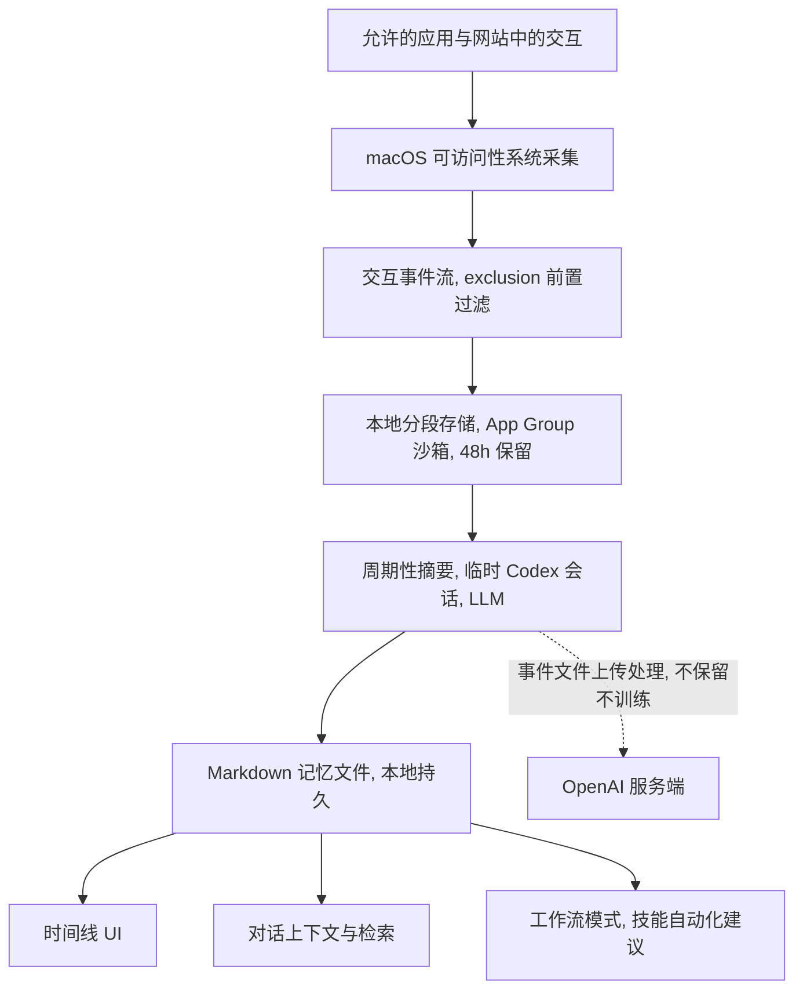

# Computer History 产品拆解（ChatGPT macOS 桌面端）

> 状态：分析文档（2026-08-14），非 ADR。来源：OpenAI 官方文档、官方 changelog、媒体报道、Linux 移植版 skysight 源码（逆向佐证）。未公开的实现细节以 [推断] 标注。

## 1. 功能描述

### 1.1 一句话定义

Computer History 是一个**默认关闭、用户显式开启**的电脑活动记忆系统：它在 macOS 上把用户在**允许的应用和网站**里的交互活动变成事件流，周期性地把事件流摘要成**纯文本记忆文件 + 时间线**，让 ChatGPT / Codex 在后续对话和任务中引用这些记忆。

### 1.2 它做什么：输入 → 输出

**输入**：用户在允许名单里的应用/网站中的交互事件——点击、打字、键盘快捷键、应用切换，以及 macOS 可访问性（Accessibility）系统暴露的上下文。**不是**截图、录屏、麦克风、系统音频，也**不包含**隐私模式浏览。

**最终得到什么**（四样东西）：

1. **一条时间线（Timeline）**：Settings > Computer history > History 中按天/时间分组的活动摘要条目。每个条目包含：标题、文字摘要、贡献了该摘要的应用列表、可选的技能/自动化建议、两个操作（在 Finder 中打开对应记忆文件、删除该条目）。
2. **一堆本地记忆文件**：纯文本 Markdown，路径 `~/.codex/memories/extensions/skysight/`，用户可读、可改、可删，一直保留到用户删除为止。
3. **一个可对话的工作记忆**：「Ask about your history」或直接提问（见 1.3）。ChatGPT 把相关记忆内容 + 事件作为上下文注入；当"读原文件比读摘要更好"时，它用历史**定位**源（某个文件、Slack 会话、Google Doc），再通过工具直接读源。
4. **工作流 → 技能/自动化建议**：当 ChatGPT 在历史中发现重复性工作模式时，时间线条目上会挂一个建议；用户审阅后让 Codex 把它变成可复用的 skill 或 automation。

### 1.3 四个核心场景（官方示例）

| 场景 | 用户输入 | 得到 |
|---|---|---|
| 续作（resume） | "我休息前在干什么？" | 不用自己重建打开的应用、文档、下一步 |
| 找回（find） | "我今早看的那个提案文档在哪？" | 用时间线定位用户记不清的源 |
| 汇总（summarize） | "总结我今天干的事，写个 standup" | 按活动摘要生成当日报告 |
| 复用（reuse） | 审阅建议 → "把这个流程做成 skill" | 从已记录的工作流生成可复用技能/自动化 |

### 1.4 明确不做（边界是产品的一部分）

- 不截屏、不录屏、不收麦克风、不收系统音频。
- 不采集隐私模式（Private Browsing / Incognito）浏览活动。
- 默认关闭；Business/Enterprise 工作区还需管理员先授权，成员才能各自开启。
- EEA、瑞士、英国不可用；API key、Amazon Bedrock 方式不可用。
- 采集范围只在允许名单内：`Exclude these apps/websites`（默认全收、拉黑）或 `Include only these apps/websites`（默认全拒、白名单）两种模式，按 URL 规则匹配网站。
- 事件文件只本地暂存 ≤48 小时，到期删除；记忆文件本地持久，但清历史会级联删除事件和由其生成的记忆。

### 1.5 可用性与门槛

Pro 个人可自行开启；Business/Enterprise 双门槛（管理员在 Workspace Settings > Permissions & roles 打开「Enable Computer History」→ 成员再个人 opt-in）。开启前置条件：Memories 必须已开启。采集期间消耗 token（每次摘要和记忆生成都计费）。

## 2. 实现路径

### 2.1 总体架构

### 2.2 采集层：macOS 可访问性系统

官方文档只披露一句话："events can include clicks, typing, keyboard shortcuts, app switches, and context that macOS exposes through its accessibility system"。据此：

- **权限**：要求的是 TCC「辅助功能（Accessibility）」授权（设置向导里的 "follow any macOS permission prompts"），**明确不需要**屏幕录制权限——这是它和 Chronicle（截屏路线）的根本区别。
- **机制 [推断]**：通过 `AXUIElement` / `AXObserver` 订阅辅助功能通知（焦点元素变化、值变化、选中文本变化、标题变化等）+ `NSWorkspace` 的应用切换通知；逐键输入（typing、shortcuts）可能走 `CGEventTap` 级全局输入事件（需要辅助功能或输入监控权限），也可能只取焦点文本元素的 `AXValue` 变化——两者均满足文档描述，官方未公开细节。
- **网站采集 [推断]**：Safari/Chrome 会把网页内容暴露给辅助功能客户端，URL 可从浏览器地址栏 UI 元素读取；"private browsing never included" 由浏览器状态或配套集成判定。
- **关键设计**：采集的是**语义事件**（哪个应用、哪个元素、值变成了什么），不是像素。这是对 Chronicle 截屏方案的替代——事件流的体积远小于截屏流，且天然排除屏幕上无法结构化的敏感内容（但代价见 2.8）。

### 2.3 事件流、分段与排除

- 事件在本地写入临时文件，隔离在 ChatGPT **App Group 容器**内（其他应用无权限访问），48 小时后由 ChatGPT/Codex 删除。
- **排除前置执行**：Linux 移植版（skysight）揭示了这一点——exclusion 规则在证据**落盘之前**执行，被过滤的内容留下 suppression 记录而非泄露进摘要。应用/网站权限变更只影响**未来**历史（"changing permissions affects future history"），不清算存量。
- 暂停/恢复是硬开关：菜单栏图标 → Computer History 菜单 → Pause/Resume；菜单栏还能按应用清除"最近一个会话"。文档明确建议：与他人通信期间要暂停（未经对方明确同意不得采集）。

### 2.4 摘要与记忆生成

- **触发**：周期性，而非实时。官方描述："periodically starts an ephemeral Codex session with access to the interaction-event stream to summarize your activity into memories."
- **数据流**：临时事件文件上传 OpenAI 服务端 → 一次性 Codex 会话做摘要 → 生成 Markdown 记忆文件存回本地 → 服务端不保留事件文件（法律要求除外）、不用于训练。
- **产物位置**：`$CODEX_HOME/memories/extensions/skysight/`（默认 `~/.codex/memories/extensions/skysight/`），与 Codex 本地记忆是同一机制。
- **滚动窗口 [Linux 移植版佐证]**：摘要按时间窗口滚动——约 10 分钟窗口生成短期摘要，6 小时窗口生成 rollup（rollup 有节流，到期才重新生成）；OCR（如 RapidOCR/Tesseract）在 skysight 里是可选回退，且严格在隐私门之后执行，命中 exclusion 的识别文本会被剥离。
- **记忆机制细节**（官方 Memories 文档）：会话空闲足够久才生成（避免总结仍在进行的工作）；跳过活跃/过短的会话；从生成的记忆字段中**脱敏 secrets**；在 rate-limit 剩余百分比低于阈值时跳过后台生成。
- **消费**：后续聊天中，相关记忆内容 + 事件作为上下文注入；"该读原文件时"，历史充当**索引**，ChatGPT/Codex 用工具（文件读取、Slack/Google 连接器）直接读源。

### 2.5 消费层：时间线 UI

- 按天/时间分组的条目：标题、文字摘要、贡献应用列表、可选技能建议、Finder 显示 / 删除操作。
- 清除粒度：删除单条、清最近 10 分钟 / 1 小时 / 1 天 / 全部；菜单栏还可清除某应用最近会话。**清除级联删除事件和由它生成的记忆，不可撤销。**
- 权限变更只影响未来；要清存量必须显式删除/清除。

### 2.6 权限模型：四层独立门控

1. **工作区层**：管理员授权（仅 Business/Enterprise）。
2. **个人层**：每成员各自 opt-in（管理员授权不等于开启）。
3. **Memories 层**：必须开启；单会话还可用 `/memories` 控制"本次聊天是否使用记忆 / 是否贡献记忆"。
4. **来源层**：应用/网站的 include/exclude 名单 + 运行时暂停。

### 2.7 风险与已知代价（官方自认）

- **未加密**：记忆文件不加密，同用户权限的其他程序可读（官方红字警告）。
- **提示注入**：应用/网站内容含恶意指令时，ChatGPT/Codex 可能照做——采集面扩大的直接后果。
- **token 成本**：摘要与记忆生成持续消耗配额。
- **隐私合规**：采集通信内容需对方同意；健康/财务/个人信息密集的应用建议排除。

### 2.8 与 Chronicle 的关系

Chronicle 是 2026 年 4 月的研究预览，用**截屏**重建上下文；Computer History 是**重建**（官方措辞 "rebuilt system, not a rename"）而非改名：事件流替代截屏，换取更小的体积、更结构化的语义、更可控的排除，代价是丢失无法结构化到辅助功能树里的视觉信息（OCR 在移植版里作为可选回退存在，官方 macOS 版是否含 OCR 未披露）。

## 3. Windows 上的对等实现

ChatGPT Windows 桌面端已存在，但 Computer History 目前是 macOS 专属。Windows 上不存在一对一 API 映射，但**每一层都有对等物**，且整套管道（分段 → 排除 → 滚动摘要 → 记忆文件 → 时间线）是平台无关的，可直接复刻。

### 3.1 事件源映射

| macOS | Windows 对等物 | 说明 |
|---|---|---|
| 辅助功能权限（TCC） | **无运行时权限提示** | Windows 没有任何 per-app 授权弹窗；普通进程默认可读其他普通进程的 UI 自动化树。产品必须自己做 consent（见 3.6） |
| AXUIElement / AXObserver | **UI Automation（UIA）** `IUIAutomation` | 语义树、焦点/文本/属性变化事件。Windows 7+ 可用，是 macOS AX 的直系对应 |
| 应用切换（NSWorkspace） | `SetWinEventHook(EVENT_SYSTEM_FOREGROUND)` | 全局事件钩子，跨进程回调，无需注入 DLL，回调线程要有消息泵 |
| 打字（AX 值变化） | UIA `TextPattern` + `UIA_Text_TextChangedEventId` | 订阅焦点文本框的 TextChanged 事件，对 `GetText(-1)` 做前后 diff 拿到变化增量；大文档退化为可见区域 diff |
| 键盘快捷键 / 点击信号 | `GetRawInputData`（`RIDEV_INPUTSINK`）或 `SetWindowsHookEx(WH_KEYBOARD_LL / WH_MOUSE_LL)` | 只拿"发生了输入"的信号与修饰键组合，**不用来捕获内容**（内容从 UIA 拿，语义才正确） |
| 前台应用元数据 | `GetForegroundWindow` + `GetWindowThreadProcessId` + `QueryFullProcessImageNameW` + `GetWindowTextW` | Trace 已有 koffi 实现可复用；用 `GetGUIThreadInfo` 拿焦点窗口/光标位置做校验 |
| App Group 沙箱 | `%LOCALAPPDATA%\` 下的私有目录 | 用户级隔离够用；可加 DPAPI（`CryptProtectData`）做 per-user 加密——Windows 上零成本，解决 macOS 版"明文落盘"的自认短板 |
| `~/.codex/memories/extensions/skysight/` | `<app-data>/memories/extensions/skysight/` 等价目录 | 记忆文件同样做成可读可改可删的 Markdown |

### 3.2 关键 API 细节

- **UIA 事件**：`IUIAutomation::AddFocusChangedEventHandler`（焦点变化）、`AddAutomationEventHandler`（`UIA_Text_TextChangedEventId`、`UIA_AutomationPropertyChangedEventId`）。TextChanged 事件不携带增量，需要缓存上次 `TextPattern::GetText(-1)` 做 diff。
- **SetWinEventHook**：`EVENT_SYSTEM_FOREGROUND`（应用切换）、`EVENT_OBJECT_FOCUS`（焦点控件）、`EVENT_OBJECT_VALUECHANGE`（值变化）、`WINEVENT_OUTOFCONTEXT` 免注入回调；专用线程 + `GetMessage` 循环即可。
- **锁屏自动暂停**：`WTSRegisterSessionNotification`（`WTS_SESSION_LOCK` / `WTS_SESSION_UNLOCK`）——锁屏、切用户、UAC 安全桌面上全局钩子和 UIA 都拿不到可靠数据，采集应硬暂停，这对应 macOS 版的 Pause 语义。
- **提权窗口（UIPI）**：中等完整性进程读不了管理员权限窗口的 UIA 树和控件值。解法是 **UIAccess 特权进程**：manifest `uiAccess="true"` + Authenticode 签名 + 安装在 Program Files（Narrator、Recall 同款姿势），或采集进程整体提权后与主进程 IPC。读提权窗口是纯采集需求，UIAccess 即可满足；不需要向提权窗口注入输入。
- **RDP / 远程会话**：UIA 与 SetWinEventHook 在会话内正常工作，无需特判；多显示器无影响。

### 3.3 浏览器与网站采集

Windows 上**不能指望 UIA 读到网页内容**：Chrome 只在辅助技术请求时才暴露页面可访问性树，Edge 的暴露程度依赖设置与版本，均不稳定。可靠路线是**配套 MV3 WebExtension**：

- `tabs.onUpdated` / `tabs.onActivated` 拿 URL + 标题，URL 规则（include/exclude）在扩展侧或管道侧执行；
- content script 拿选区文本 / 元数据作为页面语义事件（对应 macOS 的"website context"）；
- **私有模式天然对齐**：MV3 扩展默认不运行于 InPrivate/Incognito（除非用户显式允许），允许时用 `tabs.Tab.incognito` 字段强制排除——正好实现"private browsing never included"；纯 UIA 路线只能靠窗口标题启发式（"InPrivate"），不可靠，只能做兜底。

### 3.4 Windows 权限模型的差异（产品决策点）

- **没有 TCC**：Windows 用户不会收到任何授权提示，应用可以静默采集。macOS 版把同意责任押在 TCC 弹窗上，Windows 版必须**自己在产品里做 consent 流程**（首开引导页、来源名单、菜单栏/托盘暂停与状态指示），否则合规与信任风险全裸。
- **合法性问题同等**：采集通信内容需对方明确同意（OpenAI 官方建议同款）；健康/财务/个人密集应用默认建议排除。
- **竞品前车**：Microsoft Recall 走的是**截屏 + OCR + UIA + 本地语义索引**路线（Windows 11 Copilot+ PC），因截屏路线隐私争议巨大、初期无加密被安全圈痛批——Computer History 的事件流路线正是它的反面：体积小、结构语义、排除可控、无像素泄露，Windows 实现应坚持事件路线而非倒退到截屏。

### 3.5 管道复刻（平台无关部分直接照搬）

1. **事件 schema**：`{ts, kind, app, window, url?, value?}`，exclusion 规则**写盘前**执行，被滤事件记 suppression 记录（skysight 模式）。
2. **分段存储**：JSONL segment + metadata，48h 滚动保留（可配置），事件文件 DPAPI 加密。
3. **摘要**：约 10 分钟窗口短期摘要 + 6 小时 rollup（节流）→ 记忆 Markdown 文件。本地模型优先（隐私、零边际成本），云端 LLM 可选；提示注入缓解：所有采集内容一律作为**数据**对待、摘要提示词设指令边界、输出只允许写白名单路径。
4. **消费**：时间线 UI（按天分组、来源应用、删除/清除粒度 10min/1h/1d/all、Explorer 打开记忆文件）、对话引用注入、重复模式 → 技能/自动化建议（用户审阅后才生成）。

### 3.6 参考实现

| 项目 | 做法 | 与 Computer History 的差距 |
|---|---|---|
| ActivityWatch（开源） | 1s 轮询窗口标题 + 输入钩子判 AFK | 只有"用过什么"，无内容、无语义、无摘要 |
| ManicTime（商用） | 应用/文档标题 + 浏览器扩展 URL 追踪 + 时间线 + 自动打标签 | 最接近的 Windows 时序产品，但无 LLM 摘要与记忆 |
| Microsoft Recall | 截屏 + OCR + UIA + 本地语义索引 | 捕获路线相反（像素 vs 事件），隐私争议印证了事件路线的合理性 |
| RescueTime | 桌面应用 + 浏览器扩展，纯聚合 | 无内容采集 |

### 3.7 落地建议（分阶段，每阶段可独立验收）

| 阶段 | 内容 | 验证标准 |
|---|---|---|
| **P0 事件管线** | SetWinEventHook（前台切换）+ UIA 焦点变化 + 前台窗口元数据（复用 Trace 现有 koffi 模式）→ JSONL 分段 + 48h 保留 + exclusion 前置 | 采集 1 小时真实使用，事件文件有应用/窗口/时间序列，excluded 应用只留 suppression 记录 |
| **P1 内容事件** | TextPattern TextChanged diff（打字）、Raw Input 点击/快捷键信号、锁屏自动暂停 | 在记事本/IDE 打字与点击，事件文件含文本增量与快捷键事件；锁屏期间零事件 |
| **P2 浏览器源** | MV3 扩展：URL/标题/选区 + incognito 强制排除 + URL 白名单 | InPrivate 浏览不产生任何事件；白名单外 URL 零事件 |
| **P3 摘要层** | 10min/6h 滚动摘要 → Markdown 记忆文件；本地模型优先（Trace 已有 localModelManager 可接），云端 LLM 可选 | 记忆文件可读、时间窗正确、exclusion 内容不出现；注入攻击样本（网页内嵌指令）不改变摘要行为 |
| **P4 消费 UI** | 时间线视图 + 删除/清除粒度 + 暂停/恢复 + 记忆文件定位 | 时间线按天分组可浏览；清除 10min 级联删除对应事件与记忆 |
| **P5 工作流建议** | 重复模式检测 → 技能/自动化建议 → 用户审阅后生成 | 重复两次以上的流程被识别，建议卡出现，生成物为可复用技能 |

## 4. 参考来源

- OpenAI 官方：Computer History、Memories 文档（learn.chatgpt.com/docs/customization/）、ChatGPT changelog
- 媒体：9to5mac（2026-08-13）、The Register（2026-08-14）、The New Stack（2026-08-13）
- Linux 移植版 skysight 源码与文档（ilysenko/codex-desktop-linux：`record-replay-linux/src/skysight.rs`、`docs/record-and-replay-linux.md`）——事件分段、滚动窗口、exclusion 前置、OCR 回退的架构佐证
- Microsoft：UI Automation、SetWinEventHook、UIPI/UIAccess、Raw Input、WTS session 通知官方文档
- ActivityWatch 官方文档与源码（aw-watcher-window / aw-watcher-afk）
